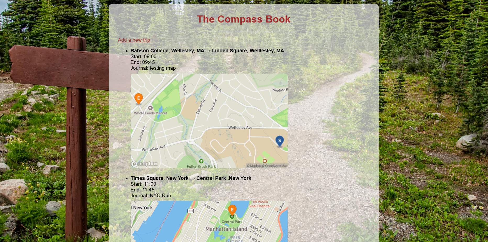
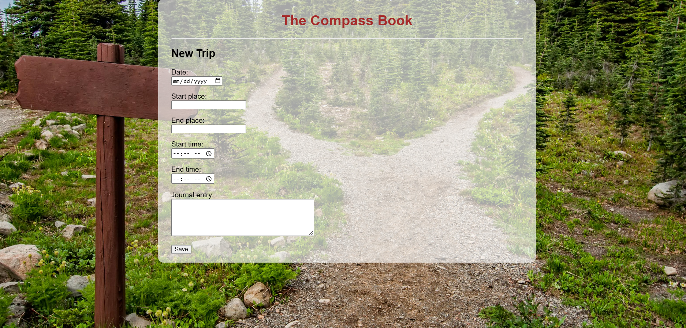

# Final-Project---Nidhi-Rudraraju

# Individual Project - Nidhi Rudraraju

The Compass Book - A Running and Hiking Journal - A web application for logging your trips and reflections

# Overview 
A web application built using Python and Flask - user can record a trip by entering details such as the start and end location, time and the user can also have an journal entry about this trip! All the entries are then saved in a CSV file. The homepage also displays all the recorded trips in a readable format and also shows the location on a map and the distance covered in kilometers(KM) . The clean UI with a centered title and a subtle mountain background and a translucent card to improve readability. This helps the user keep track of all the activities they did and also how they felt during each of the activities. 

Homepage with trips added

New trip form

# Flow Diagram 
User submits a new trip ---> Flask receives the request ---> The data is added to trips.csv ---> homepage reads the CSV file ---> displays all the trips along with maps 

# Project Reflection 
This project started off as a simple running journal that was more developed into a more sophisticated web journal. Throughout the development I faced challenges trying to use MapBox to visualize the points and I also faced troubles to connect the entered data into a proper readable format. In the future I would like to add a feature where the user is able to add pictures & videos as well and those would be displayed on the homescreen. In the next iteration I would also want to add the option of adding multiple stops in the same trip to make it more accurate.
